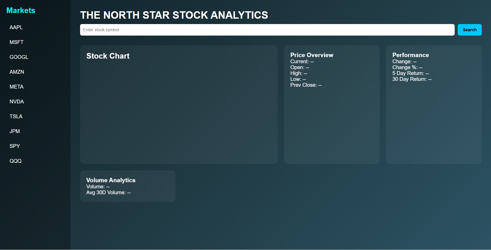

# Stock-forecast
# 📈 North Star Stock Analytics (Frontend Version)

A modern stock analytics dashboard built using HTML, CSS, and JavaScript.

This project allows users to search stock symbols and view real-time market data including:

- 📊 30-day price chart
- 💰 Current price
- 📈 Daily change & percentage
- 📉 5-day return
- 📊 30-day return
- 📦 Volume analytics
- 📂 Sidebar quick-select stocks

---

## 📸 Preview




---

## 🚀 Features

- Interactive stock chart using Chart.js
- Dark-themed modern UI
- Sidebar with clickable popular stocks
- 30-day historical data visualization
- Performance analytics
- Responsive layout
- Uses Alpha Vantage API

---

## 🛠 Tech Stack

- HTML5
- CSS3
- JavaScript (Vanilla JS)
- Chart.js
- Alpha Vantage API

---

## 📂 Project Structure
```css
project
│
├── index.html
├── index.css
├── index.js
└── README.md
```


---

## 🔑 API Key Setup

This project uses the Alpha Vantage API.

To run this project:

1. Get a free API key from:
   https://www.alphavantage.co/support/#api-key

2. Open `index.js`

3. Replace:

```js
const API_KEY = "YOUR_API_KEY_HERE";
```

## 📂 Project Structure
